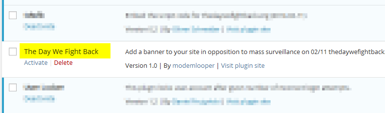
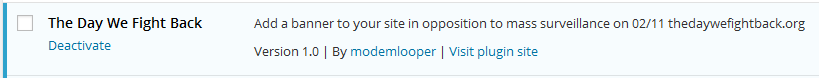
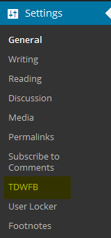

DEAR USERS OF THE INTERNET,

In January 2012 we defeated the SOPA and PIPA censorship legislation with the largest Internet protest in history. Today we face another critical threat, one that again undermines the Internet and the notion that any of us live in a genuinely free society: mass surveillance.

In celebration of the win against SOPA and PIPA two years ago, and in memory of one of its leaders, Aaron Swartz, we are planning a day of protest against mass surveillance, to take place this February 11th.

Together we will push back against powers that seek to observe, collect, and analyze our every digital action. Together, we will make it clear that such behavior is not compatible with democratic governance. Together, if we persist, we will win this fight.

https://thedaywefightback.org

---

Plugin based on https://github.com/tfrce/thedaywefightback.js

## Installation

Upload `tdwfb.zip` to your WordPress plugins folder, unpack it into its own folder there, such as `wp-content/plugins/tdwfb`, and activate in the admin dashboard. See below.

### On the sidbar

... find the Plugins and go to the ...

### Plugins list

... where you find the plugin as "The Day We Fight Back" and click the Activate link below the plugin name

... and see this after activation:

## Configuration settings

In the sidebar of the dashboard find the "Settings" item and expand it by clicking once. If you successfully installed this plugin you should see it on the expanded list like so:

Follow the link labeled "TDWFB" to get to the settings screen:

### Remarks

The banner is meant to be displayed on the date of the event. Leave Display date unchecked and the banner will display at midnight on 2/11 and last for 24 hours. To test the banner check Display date option and visit the front of your site. 

## Features

- Custom Greeting text
- Display banner before date 2/11
- Display only call form

## Demonstration

http://tfrce.github.io/thedaywefightback.js/example/banner.html

## Known issues

If you activate plugin and banner isn't showing check the "Disable date" option. You may need to delete your cache if running a cache plugin.
